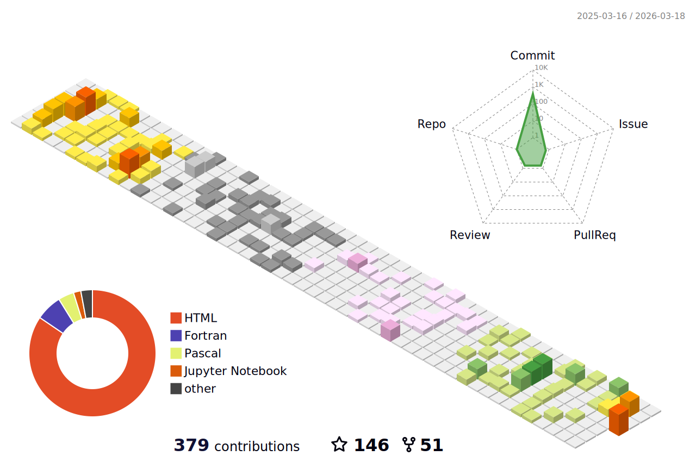

## 
:memo: We, a theoretical group at Tohoku Univerisity, solid-state theory, simulation, and machine learning for quantum materials.

#### 📫 How to reach us: [Homepage](https://nguyen-group.github.io/) || [Google Scholar](https://scholar.google.com/citations?user=7O6Qq_kAAAAJ&hl=en) || [Scopus](https://www.scopus.com/authid/detail.uri?authorId=56912954900)

#### :rocket: This GitHub contains our codes, examples, and data for our books, codes, and papers:

## My activity:

  

