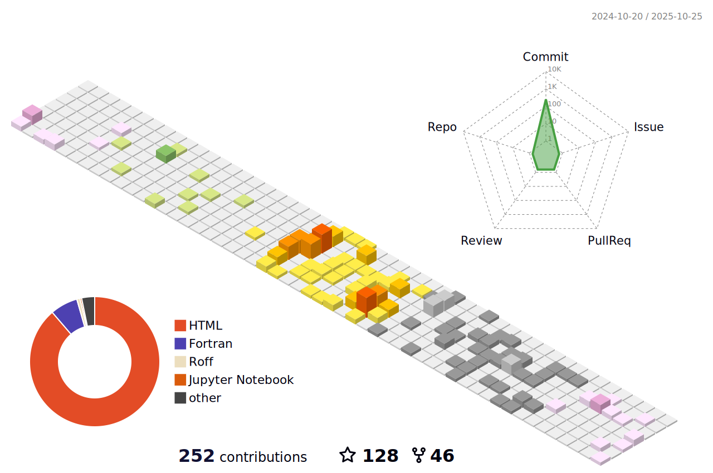

## Welcome to Interdisciplinary Quantum Materials's Group (i-QM) at National Taiwan University
:memo: We are a theory-driven experimentation group using first-principles methods, machine learning, and advanced characterization to design and understand quantum materials.

#### 📫 How to reach us: [Homepage](https://nguyen-group.github.io/) || [Google Scholar](https://scholar.google.com/citations?user=7O6Qq_kAAAAJ&hl=en) || [Scopus](https://www.scopus.com/authid/detail.uri?authorId=56912954900)

#### :rocket: This GitHub contains our codes, examples, and data for our books, codes, and papers:

## My activity:

  

